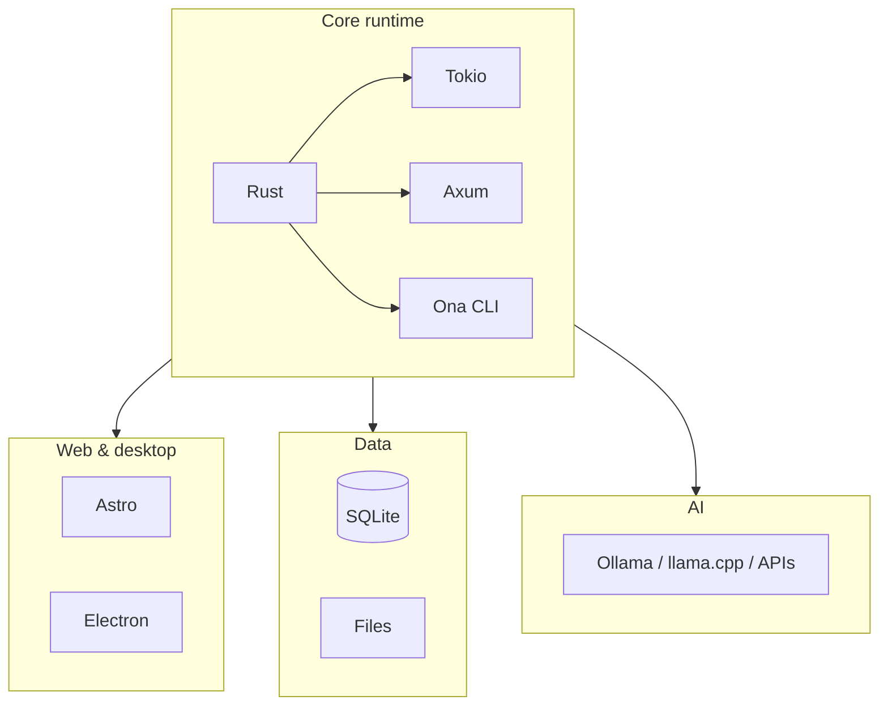
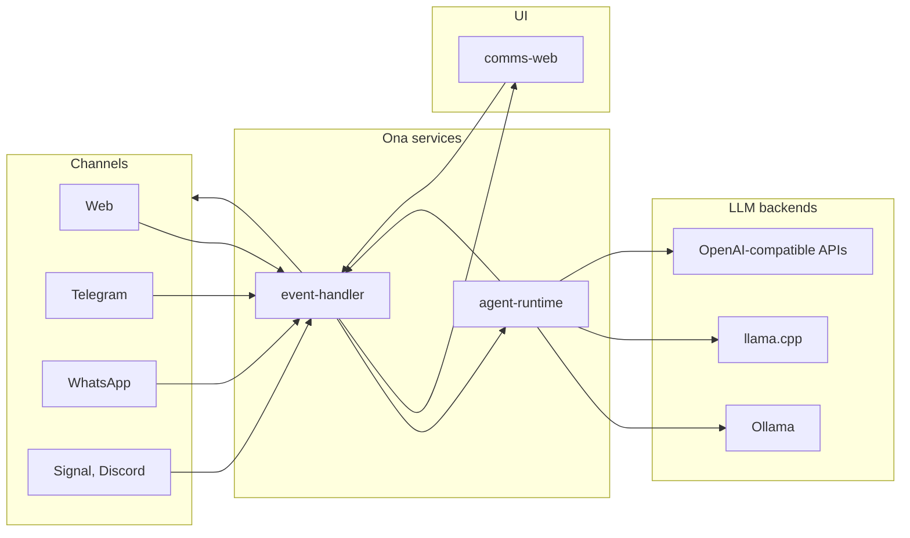
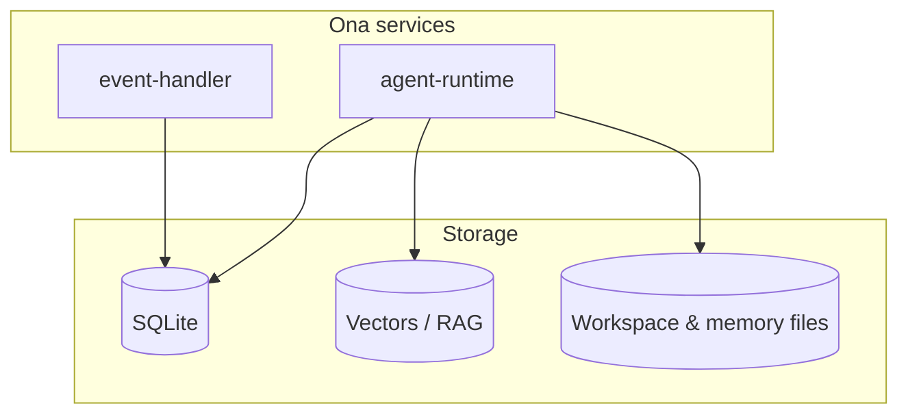
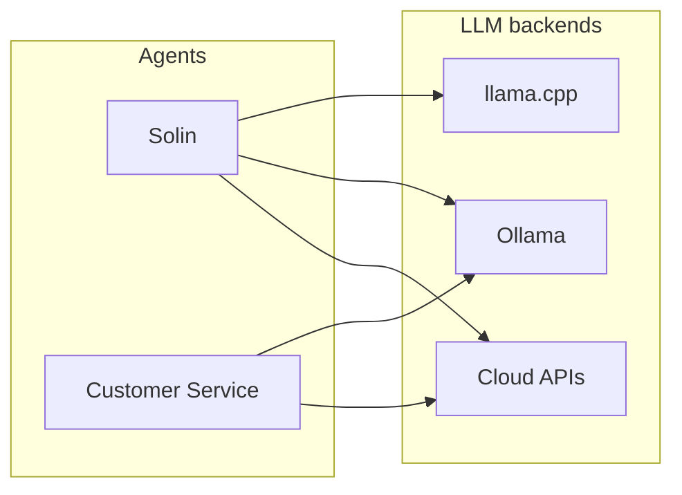
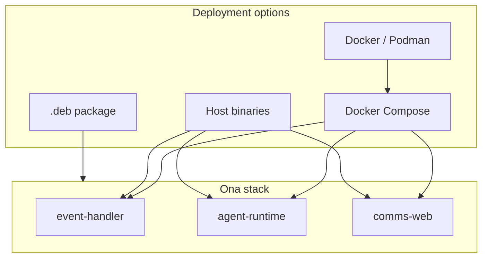
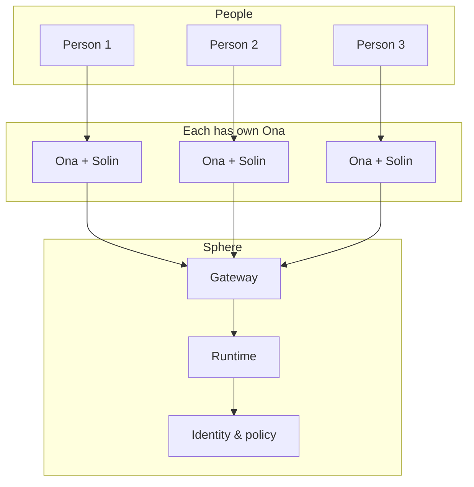

# Ona & Ona Sphere — Technical Stack

**Last updated (UTC): 2026-03-15**

This document gives a high-level overview of the technologies Ona and Ona Sphere are built with. It is for anyone who wants to know what’s “under the hood” without reading the main (private) codebase. For what Ona and Sphere *are* and how they connect, see [WHAT_IS_ONA_AND_SPHERE.md](WHAT_IS_ONA_AND_SPHERE.md).

---

## Core runtime

| Layer | Technology | Role |
|-------|------------|------|
| **Language** | **Rust** (edition 2021) | Core services and CLI are written in Rust. Single workspace with multiple crates (libraries and binaries). |
| **Async runtime** | **Tokio** | Async I/O, HTTP, and concurrency across services. |
| **HTTP & APIs** | **Axum** | Web framework for REST and WebSocket endpoints. |
| **CLI** | **Ona CLI** (Rust) | Main entry point for install, start, stop, jobs, memory, models, and all commands. Built as part of the Rust workspace. |

---

## Main services (Ona)

The main Ona deployment runs a small set of services that work together:

| Service | Purpose |
|---------|---------|
| **event-handler** | Ingests webhooks (web, Telegram, WhatsApp, Signal, Discord), creates jobs, routes to orchestration, and streams responses back to channels. |
| **agent-runtime** | Executes the agent loop: calls the LLM, runs tools, uses memory and RAG, and coordinates specialist sub-agents. |
| **orchestration-service** | (Used by event-handler) Job lifecycle, routing, and coordination. |
| **comms-web** | Web UI for chat, onboarding, and mission control. Served as static/site. |

All of the above are Rust binaries (except the web UI). The web UI is built separately and served by a small web server or in Docker.

---

## Web & desktop

| Component | Technology | Role |
|-----------|------------|------|
| **Web UI** | **Astro** | Frontend for chat, onboarding, and settings. Static build; CodeMirror for in-app code/docs. |
| **Desktop app** | **Electron** | Wraps the web UI so you can run Ona as a desktop app (e.g. mission control, chat). |

---

## Data & storage

| Use | Technology | Notes |
|-----|------------|--------|
| **Primary database** | **SQLite** | Jobs, state, and app data. Single file; no separate DB server by default. |
| **Optional database** | **PostgreSQL** | Supported for scale or existing infra; not required for typical self-host. |
| **Vectors / RAG** | **Embeddings + vector store** | Stored in project data (e.g. SQLite-based or dedicated vector DB) for memory and knowledge search. |
| **Workspace & memory** | **Files (e.g. Markdown)** | Persistent memory and workspace content live as files under a configurable data directory. |

---

## AI & models

| Area | Technology | Role |
|------|------------|------|
| **Local inference** | **Ollama** | Easiest local LLM backend; auto-discovery of installed models. |
| **Local inference** | **llama.cpp** (GGUF) | OpenAI-compatible server for GGUF models; can run on host or in containers. |
| **APIs** | **OpenAI-compatible** | Cloud or local endpoints (OpenAI, Claude, Groq, Gemini, or local servers) via a single API shape. |
| **Routing** | **Per-agent** | Different agents (e.g. main Solin vs customer-service) can use different models and backends. |

---

## Deployment & ops

| Area | Technology | Role |
|------|------------|------|
| **Containers** | **Docker** (or **Podman**) | Default way to run Ona: one Compose file for event-handler, agent-runtime, comms-web, and optional model containers. |
| **Orchestration** | **Docker Compose** | Defines services, networks, and volumes. Optional profile for extra model containers (e.g. GGUF servers). |
| **Host / bare metal** | **Rust binaries + scripts** | You can run the same Rust binaries and web build on the host (no Docker) for development or lightweight installs. |
| **Package** | **Debian (.deb)** | Optional; build and install Ona as a system package. |

---

## Ona Sphere (optional)

When many people (each with their own Ona) connect through Sphere:

| Component | Technology | Role |
|-----------|------------|------|
| **Gateway** | **Rust (Axum)** | Sphere gateway service: identity, routing, and policy at the edge. |
| **Sphere runtime** | **Rust** | Agent runtime and governance logic for the shared layer. |
| **Web** | **Static + small server** | Optional web UI for Sphere (e.g. Python or Node server for static assets). |

Sphere is a separate deployable; Ona works fully without it.

---

## Development & tooling

| Area | Tool / tech | Notes |
|------|-------------|--------|
| **Build** | **Cargo** | `cargo build`, workspace with shared dependencies and release profiles. |
| **Scripts** | **Bash, PowerShell** | Install, start, stop, doctor, update; cross-platform where possible. |
| **CI** | **GitHub Actions** | Build, test, and optional checks (e.g. memory leak detection). |

---

## Summary

- **Backend:** Rust (Tokio, Axum), SQLite (or Postgres), file-based memory/workspace.
- **Frontend:** Astro (web), Electron (desktop).
- **AI:** Ollama, llama.cpp, and any OpenAI-compatible API; per-agent routing.
- **Deploy:** Docker Compose (or Podman), optional .deb; host binaries for dev/simple installs.
- **Sphere:** Optional Rust-based gateway and runtime that connect multiple Onas.

For community, contributing, and policies, see [README.md](README.md) and [CONTRIBUTING.md](CONTRIBUTING.md).
