# Ona & Ona Sphere — Technical Stack

**Last updated (UTC): 2026-03-15** — Expanded from ref docs: agent model, memory layers, RAG pipeline, channels, security, pluggable subsystems, follow-ups/todos.

This document gives a high-level overview of the technologies Ona and Ona Sphere are built with. It is for anyone who wants to know what’s “under the hood” without reading the main (private) codebase. For what Ona and Sphere *are* and how they connect, see [WHAT_IS_ONA_AND_SPHERE.md](WHAT_IS_ONA_AND_SPHERE.md).

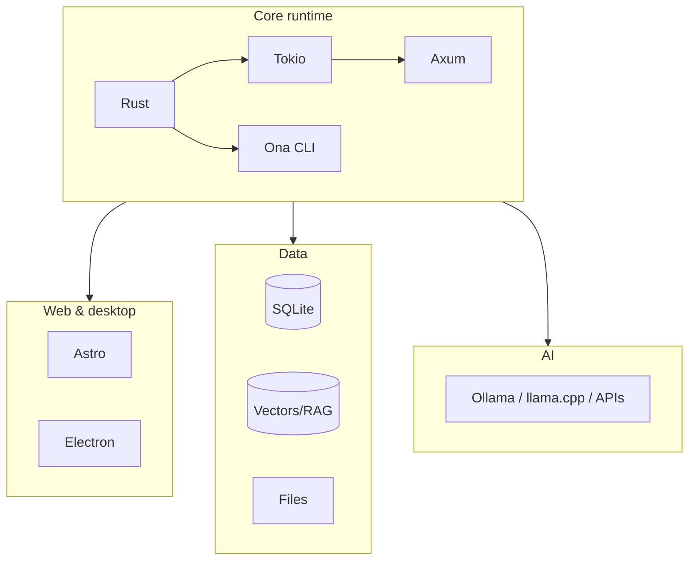
```mermaid
flowchart TB
  subgraph runtime["Core runtime"]
    Rust[Rust]
    Tokio[Tokio]
    Axum[Axum]
    CLI[Ona CLI]
  end
  subgraph front["Web & desktop"]
    Astro[Astro]
    Electron[Electron]
  end
  subgraph data["Data"]
    SQL[(SQLite)]
    VEC[(Vectors/RAG)]
    Files[Files]
  end
  subgraph ai["AI"]
    LLM[Ollama / llama.cpp / APIs]
  end
  Rust --> Tokio
  Tokio --> Axum
  Rust --> CLI
  runtime --> front
  runtime --> data
  runtime --> ai
```

---

## Core runtime

| Layer | Technology | Role |
|-------|------------|------|
| **Language** | **Rust** (edition 2021) | Core services and CLI are written in Rust. Single workspace with multiple crates (libraries and binaries). |
| **Async runtime** | **Tokio** | Async I/O, HTTP, and concurrency across services. |
| **HTTP & APIs** | **Axum** | Web framework for REST and WebSocket endpoints. |
| **CLI** | **Ona CLI** (Rust) | Main entry point for install, start, stop, jobs, memory, models, and all commands. Built as part of the Rust workspace. |

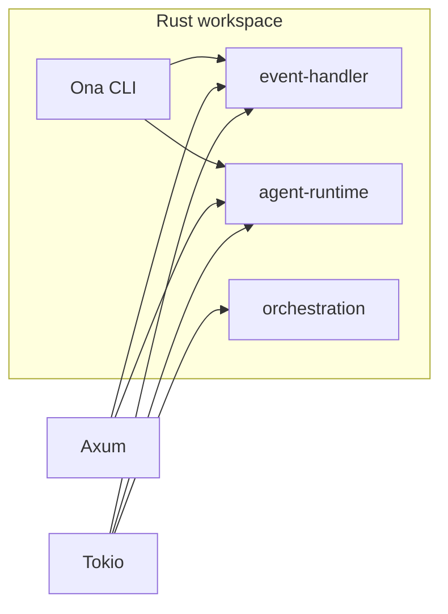
```mermaid
flowchart LR
  subgraph rust["Rust workspace"]
    CLI[Ona CLI]
    EH[event-handler]
    AR[agent-runtime]
    OS[orchestration]
  end
  Tokio[Tokio] --> EH
  Tokio --> AR
  Tokio --> OS
  Axum[Axum] --> EH
  Axum --> AR
  CLI --> EH
  CLI --> AR
```

---

## Main services (Ona)

The main Ona deployment runs a small set of services that work together:

| Service | Purpose |
|---------|---------|
| **event-handler** | Ingests webhooks (web, Telegram, WhatsApp, Signal, Discord), creates jobs, routes to orchestration, and streams responses back to channels. |
| **agent-runtime** | Executes the agent loop: calls the LLM, runs tools, uses memory and RAG, and coordinates specialist sub-agents. |
| **orchestration-service** | (Used by event-handler) Job lifecycle, routing, and coordination. |
| **comms-web** | Web UI for chat, onboarding, and mission control. Served as static/site. |

All of the above are Rust binaries (except the web UI). The web UI is built separately and served by a small web server or in Docker. When **gateway mode** is on (default in Docker), the event-handler process also runs orchestration (Solin) — one process for webhooks, job creation, and squad coordination.

### Agent model (squad, tools, skills)

| Concept | Role |
|---------|------|
| **Solin** | Orchestrator: parses missions, decomposes into tasks, delegates to specialists, aggregates results. Does not run tools; coordinates the squad. |
| **Task agents** | Ephemeral specialists (Writer, Researcher, Developer, Marketer, etc.) created per sub-task. Each has a persona, tools, and access to memory; destroyed after the task by default. |
| **Learning agent** | Persistent agent that accumulates knowledge over time; never receives system secrets; holds user preferences and learned patterns. Survives resets. |
| **Observer (optional)** | Per-mission watcher: checks agents are on-task and safe; can request pause. Does not execute tasks. |
| **Guardian (optional)** | Security watcher: prompt injection, tool abuse, data exfil, memory poisoning; can block high-risk actions. Does not execute tasks. |
| **Tools** | Code execution, file I/O, search, memory read/write, RAG recall, browser (optional), custom skills. Developer agent: build and run projects, tests. |
| **Skills** | Capabilities defined in **SKILL.md** (input schema, tool descriptions, guards). Agents load skills by task relevance; no hardcoded tools. |
| **Mission group chat** | Solin and all sub-agents share one thread per mission; user sees the conversation; agents can @mention and collaborate. |

**Follow-ups & todos:** Scheduler and cron for recurring jobs; follow-up delivery (e.g. "I'll check back in 2 days"); todo create/list/update from missions or user; optional direct-action routing (todo/reminder) before full mission flow.

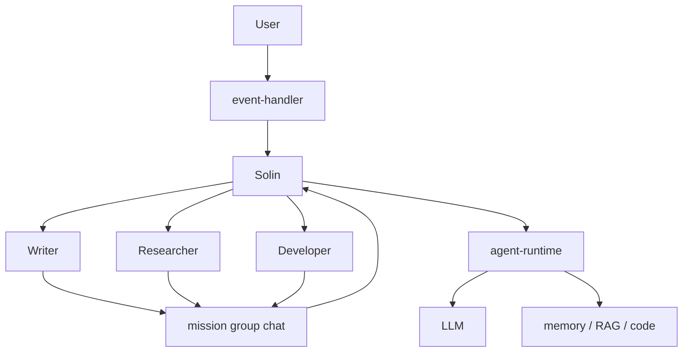
```mermaid
flowchart TB
  User[User] --> EH[event-handler]
  EH --> Solin[Solin]
  Solin --> T1[Writer]
  Solin --> T2[Researcher]
  Solin --> T3[Developer]
  T1 --> Chat[mission group chat]
  T2 --> Chat
  T3 --> Chat
  Chat --> Solin
  Solin --> AR[agent-runtime]
  AR --> LLM[LLM]
  AR --> Tools[memory / RAG / code]
```

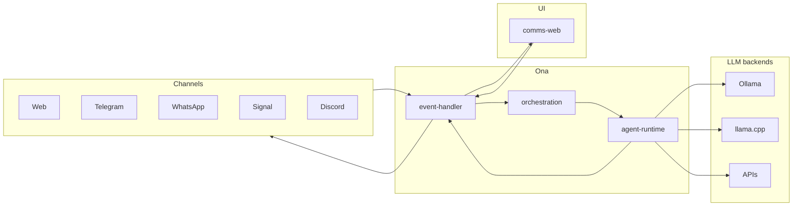
```mermaid
flowchart LR
  subgraph channels["Channels"]
    Web[Web]
    TG[Telegram]
    WA[WhatsApp]
    Sig[Signal]
    Dis[Discord]
  end
  subgraph ona["Ona"]
    EH[event-handler]
    Solin[orchestration]
    AR[agent-runtime]
  end
  subgraph ui["UI"]
    CW[comms-web]
  end
  subgraph llm["LLM backends"]
    Ollama[Ollama]
    Llama[llama.cpp]
    API[APIs]
  end
  channels --> EH
  CW --> EH
  EH --> Solin
  Solin --> AR
  AR --> Ollama
  AR --> Llama
  AR --> API
  AR --> EH
  EH --> CW
  EH --> channels
```

---

## Web & desktop

| Component | Technology | Role |
|-----------|------------|------|
| **Web UI** | **Astro** | Frontend for chat, onboarding, and settings. Static build; CodeMirror for in-app code/docs. |
| **Desktop app** | **Electron** | Wraps the web UI so you can run Ona as a desktop app (e.g. mission control, chat). |

**Surfaces:** Mission control (dashboard + chat), onboarding wizard, squad view, memory, knowledge, jobs, scheduler, approvals, settings. Principle: every function has a UI; no feature is API-only.

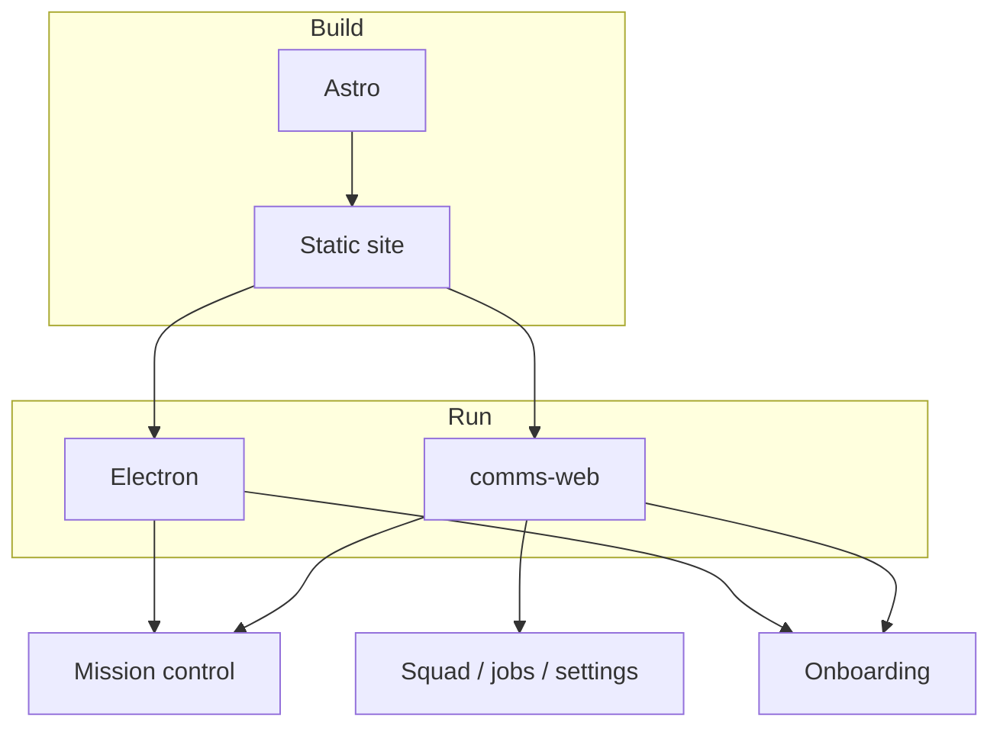
```mermaid
flowchart TB
  subgraph build["Build"]
    Astro[Astro]
    Static[Static site]
  end
  subgraph run["Run"]
    Web[comms-web]
    Electron[Electron]
  end
  Astro --> Static
  Static --> Web
  Static --> Electron
  Web --> Mission[Mission control]
  Web --> Onboard[Onboarding]
  Web --> Squad[Squad / jobs / settings]
  Electron --> Mission
  Electron --> Onboard
```

---

## Channels & comms

| Channel | Role |
|---------|------|
| **Web** | WebSocket + HTTP; chat, mic for voice. |
| **Telegram** | Bot API, webhooks; text and voice messages. |
| **WhatsApp** | Business API / third-party adapters; text and voice. |
| **Signal** | signal-cli / signal-cli-rest-api; text and voice. |
| **Discord** | Bot; text and voice. |
| **REST API** | HTTP/JSON for jobs, status, and integrations. |

Voice is first-class: STT (e.g. Whisper, local or hosted) for input; TTS (e.g. OpenAI, Piper) for spoken replies. Same mission system across all channels.

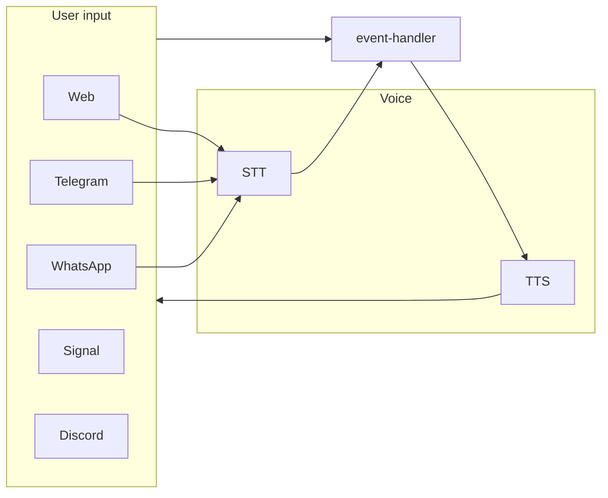
```mermaid
flowchart LR
  subgraph in["User input"]
    Web[Web]
    TG[Telegram]
    WA[WhatsApp]
    Sig[Signal]
    Dis[Discord]
  end
  subgraph voice["Voice"]
    STT[STT]
    TTS[TTS]
  end
  EH[event-handler]
  in --> EH
  Web --> STT
  TG --> STT
  WA --> STT
  STT --> EH
  EH --> TTS
  TTS --> in
```

---

## Data & storage

| Use | Technology | Notes |
|-----|------------|--------|
| **Primary database** | **SQLite** | Jobs, state, and app data. Single file; no separate DB server by default. |
| **Optional database** | **PostgreSQL** | Supported for scale or existing infra; not required for typical self-host. |
| **Vectors / RAG** | **Embeddings + vector store** | Stored in project data (e.g. SQLite-based or dedicated vector DB) for memory and knowledge search. |
| **Workspace & memory** | **Files (e.g. Markdown)** | Persistent memory and workspace content live as files under a configurable data directory. |

**Memory layers (high-level):**

| Layer | Purpose | Backing |
|-------|---------|---------|
| **Identity** | Agent personality, values | Identity files (e.g. SOUL, HEARTBEAT) |
| **Long-term** | Curated preferences, facts, projects | MEMORY.md, memory table |
| **Daily** | Session context, decisions | Daily markdown (e.g. memory/YYYY-MM-DD.md) |
| **User memory** | Learned preferences and facts about the user | RAG + structured store; agents personalize from it |
| **Collaborative** | Mission group chat, team-proven solutions | Mission-scoped fragments and solutions |
| **RAG** | Semantic search over docs and knowledge base | Vector store (e.g. SQLite+sqlite-vec or dedicated vector DB) |
| **Session** | Current conversation continuity | Session ID on jobs; recent turns in context |

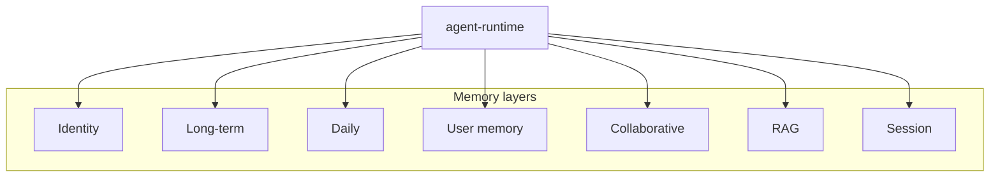
```mermaid
flowchart TB
  subgraph layers["Memory layers"]
    ID[Identity]
    LT[Long-term]
    Daily[Daily]
    User[User memory]
    Collab[Collaborative]
    RAG[RAG]
    Session[Session]
  end
  AR[agent-runtime] --> ID
  AR --> LT
  AR --> Daily
  AR --> User
  AR --> Collab
  AR --> RAG
  AR --> Session
```

**RAG pipeline:** Documents are chunked, embedded, and stored in a vector index. On query, the system retrieves top-k relevant chunks (semantic and optionally keyword), then injects them into the LLM context before generation. Embeddings can come from a dedicated embedding model (e.g. nomic-embed-text); chat models are not used for embedding.

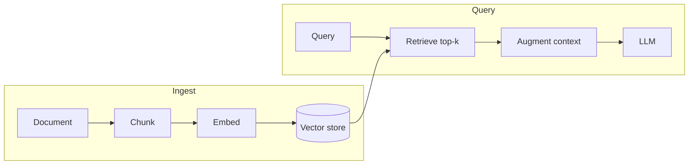
```mermaid
flowchart LR
  subgraph ingest["Ingest"]
    Doc[Document]
    Chunk[Chunk]
    Embed[Embed]
    Store[(Vector store)]
  end
  subgraph query["Query"]
    Q[Query]
    Retrieve[Retrieve top-k]
    Augment[Augment context]
    LLM[LLM]
  end
  Doc --> Chunk --> Embed --> Store
  Q --> Retrieve
  Store --> Retrieve
  Retrieve --> Augment --> LLM
```

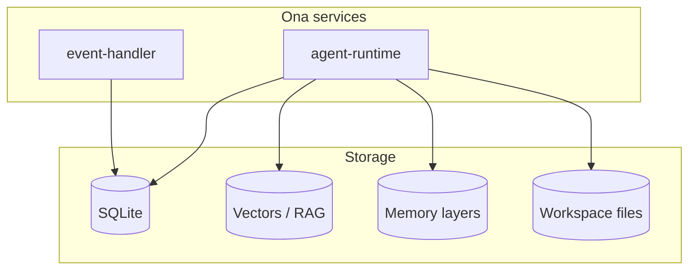
```mermaid
flowchart TB
  subgraph app["Ona services"]
    EH[event-handler]
    AR[agent-runtime]
  end
  subgraph storage["Storage"]
    SQL[(SQLite)]
    VEC[(Vectors / RAG)]
    MEM[(Memory layers)]
    FS[(Workspace files)]
  end
  EH --> SQL
  AR --> SQL
  AR --> VEC
  AR --> MEM
  AR --> FS
```

---

## AI & models

| Area | Technology | Role |
|------|------------|------|
| **Local inference** | **Ollama** | Easiest local LLM backend; auto-discovery of installed models. |
| **Local inference** | **llama.cpp** (GGUF) | OpenAI-compatible server for GGUF models; can run on host or in containers. |
| **APIs** | **OpenAI-compatible** | Cloud or local endpoints (OpenAI, Claude, Groq, Gemini, or local servers) via a single API shape. |
| **Routing** | **Per-agent** | Different agents (e.g. main Solin vs customer-service) can use different models and backends. |
| **Provider adapters** | **Backend-agnostic** | OpenAI-compatible, Ollama, Anthropic, Gemini, custom HTTP; same chat interface, swap provider via config. |

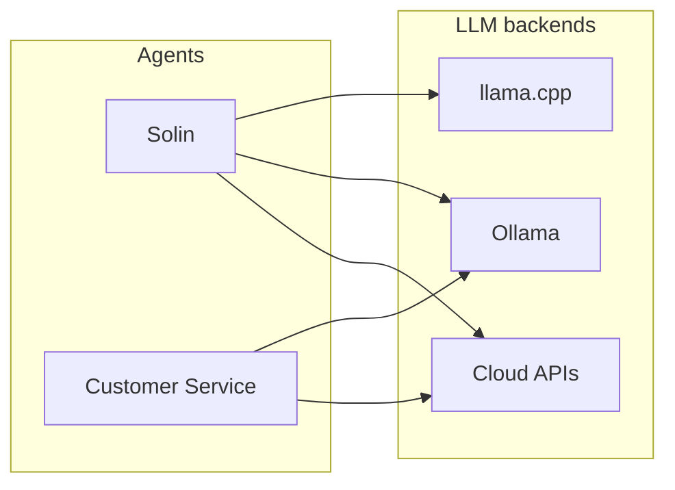
```mermaid
flowchart LR
  subgraph agents["Agents"]
    Solin[Solin]
    CS[Customer Service]
  end
  subgraph backends["LLM backends"]
    Ollama[Ollama]
    Llama[llama.cpp]
    Cloud[Cloud APIs]
  end
  Solin --> Llama
  Solin --> Ollama
  Solin --> Cloud
  CS --> Ollama
  CS --> Cloud
```

---

## Deployment & ops

| Area | Technology | Role |
|------|------------|------|
| **Containers** | **Docker** (or **Podman**) | Default way to run Ona: one Compose file for event-handler, agent-runtime, comms-web, and optional model containers. |
| **Orchestration** | **Docker Compose** | Defines services, networks, and volumes. Optional profile for extra model containers (e.g. GGUF servers). |
| **Host / bare metal** | **Rust binaries + scripts** | You can run the same Rust binaries and web build on the host (no Docker) for development or lightweight installs. |
| **Package** | **Debian (.deb)** | Optional; build and install Ona as a system package. |

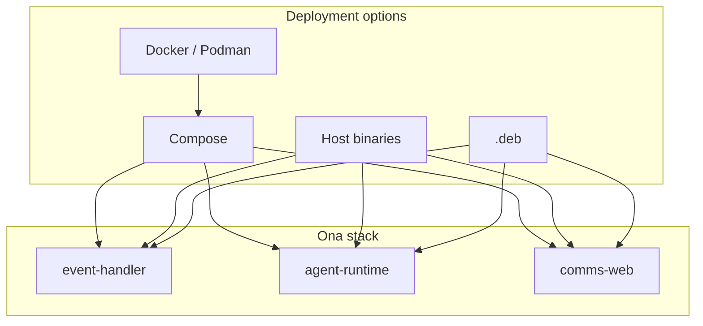
```mermaid
flowchart TB
  subgraph opts["Deployment options"]
    Docker[Docker / Podman]
    Compose[Compose]
    Host[Host binaries]
    Deb[.deb]
  end
  subgraph stack["Ona stack"]
    EH[event-handler]
    AR[agent-runtime]
    CW[comms-web]
  end
  Docker --> Compose
  Compose --> EH
  Compose --> AR
  Compose --> CW
  Host --> EH
  Host --> AR
  Host --> CW
  Deb --> EH
  Deb --> AR
  Deb --> CW
```

---

## Tech stack: Ona Sphere

Sphere is the layer that **connects the Onas**. Each person has their own Ona and Solin; when they need to work together, their Onas connect to one Sphere. Sphere is a **separate deployable** with its own services, data, and lifecycle — Ona works fully without it.

### Sphere: core runtime

| Layer | Technology | Role |
|-------|------------|------|
| **Language** | **Rust** (edition 2021) | Gateway and agent runtime are Rust. Small Cargo workspace (gateway + agent-runtime). |
| **Async runtime** | **Tokio** | Async I/O and concurrency. |
| **HTTP & APIs** | **Axum** | Web framework for gateway and runtime endpoints. |
| **CLI / scripts** | **Bash** | `sphere setup`, `sphere start`, `sphere stop`, `sphere status`, `sphere doctor`, `sphere app` (lifecycle and desktop). |

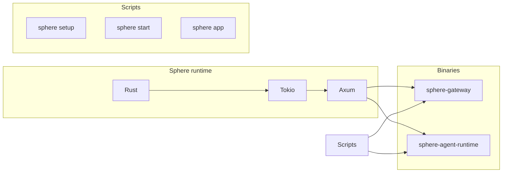
```mermaid
flowchart LR
  subgraph sphere_runtime["Sphere runtime"]
    Rust[Rust]
    Tokio[Tokio]
    Axum[Axum]
  end
  subgraph bins["Binaries"]
    GW[sphere-gateway]
    RT[sphere-agent-runtime]
  end
  subgraph scripts["Scripts"]
    Setup[sphere setup]
    Start[sphere start]
    App[sphere app]
  end
  Rust --> Tokio
  Tokio --> Axum
  Axum --> GW
  Axum --> RT
  Scripts --> GW
  Scripts --> RT
```

### Sphere: main services

| Service | Purpose |
|---------|---------|
| **sphere-gateway** | Entry point: identity, routing, and policy at the edge. Onas and clients talk to the gateway; it forwards to the runtime and worker agents. |
| **sphere-agent-runtime** | Core runtime: orchestration, drive/shared data, and coordination with worker agents. |
| **Worker agents** | Role-based agents (e.g. server-operator, server-gateway, server-lockbox, server-guardian) for governance, scoped broker, and policy — same binary, different roles and ports. |
| **sphere-web** | Web UI for status, audit, timeline, and controls. Static assets plus a small server (e.g. Python or Node). |
| **Electron** | Optional desktop shell that loads sphere-web (`sphere app`). |

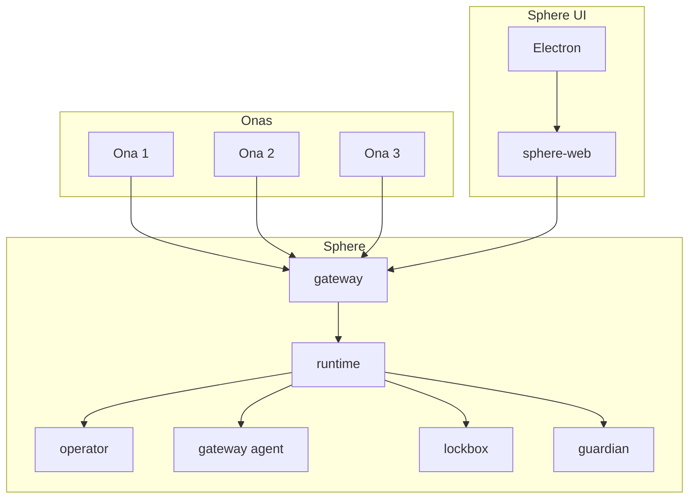
```mermaid
flowchart TB
  subgraph onas["Onas"]
    O1[Ona 1]
    O2[Ona 2]
    O3[Ona 3]
  end
  subgraph sphere["Sphere"]
    GW[gateway]
    RT[runtime]
    OP[operator]
    GWAG[gateway agent]
    LB[lockbox]
    GUA[guardian]
  end
  subgraph ui["Sphere UI"]
    Web[sphere-web]
    App[Electron]
  end
  O1 --> GW
  O2 --> GW
  O3 --> GW
  GW --> RT
  RT --> OP
  RT --> GWAG
  RT --> LB
  RT --> GUA
  Web --> GW
  App --> Web
```

### Sphere: how Onas connect to Sphere

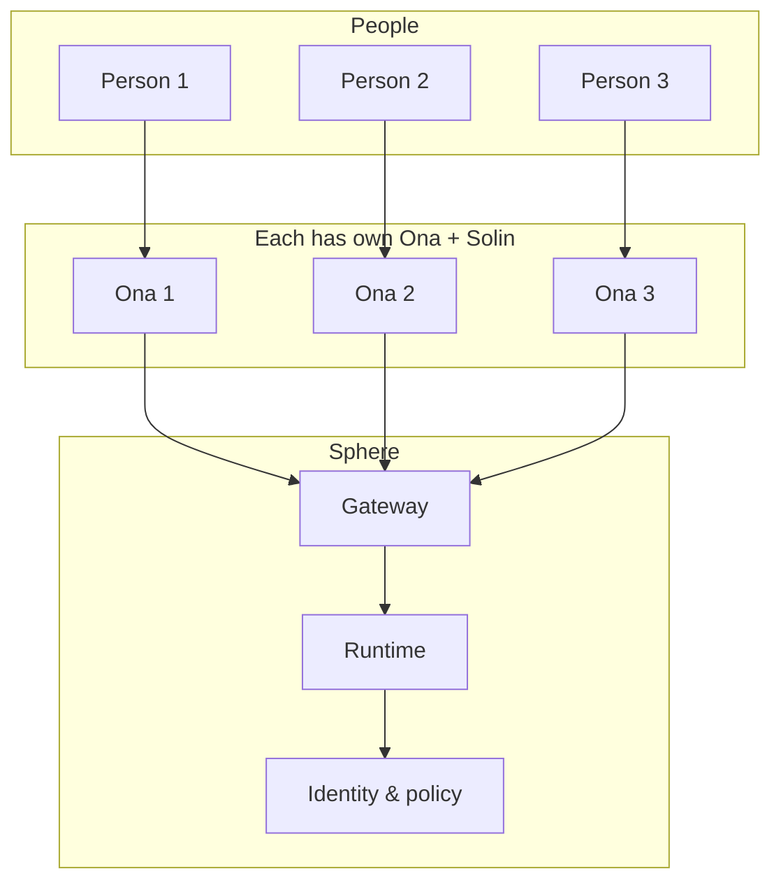
```mermaid
flowchart TB
  subgraph users["People"]
    U1[Person 1]
    U2[Person 2]
    U3[Person 3]
  end
  subgraph onas["Each has own Ona + Solin"]
    O1[Ona 1]
    O2[Ona 2]
    O3[Ona 3]
  end
  subgraph sphere["Sphere"]
    GW[Gateway]
    RT[Runtime]
    ID[Identity & policy]
  end
  U1 --> O1
  U2 --> O2
  U3 --> O3
  O1 --> GW
  O2 --> GW
  O3 --> GW
  GW --> RT
  RT --> ID
```

### Sphere: data & models

| Area | Technology | Notes |
|------|------------|--------|
| **Shared / drive data** | **Files + runtime** | Sphere can use a dedicated data directory for drive/shared content and audit. |
| **Identity & policy** | **In-memory / config** | Tenant, user, roles, and policy enforced at gateway and runtime. |
| **Models (optional)** | **Ollama, llama.cpp** | Sphere can run its own Ollama and/or llama.cpp (OpenAI-compatible) so Onas can use Sphere as a model host; discovery via status API. |

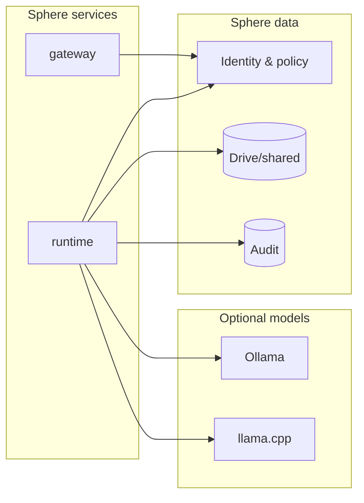
```mermaid
flowchart LR
  subgraph sphere_svc["Sphere services"]
    GW[gateway]
    RT[runtime]
  end
  subgraph sphere_data["Sphere data"]
    ID[Identity & policy]
    DRIVE[(Drive/shared)]
    AUDIT[(Audit)]
  end
  subgraph models["Optional models"]
    Ollama[Ollama]
    Llama[llama.cpp]
  end
  GW --> ID
  RT --> ID
  RT --> DRIVE
  RT --> AUDIT
  RT --> Ollama
  RT --> Llama
```

### Sphere: deployment

| Area | Technology | Role |
|------|------------|------|
| **Containers** | **Docker Compose** | `docker-compose.sphere.yml` for gateway, runtime, and worker agents. |
| **Host / local** | **Rust binaries + scripts** | Run gateway and runtime (and optional workers) on the host; `sphere start` / `sphere stop`. |
| **Standalone install** | **Scripts** | `sphere setup`, `sphere install` for a standalone Sphere install (e.g. from a download). |

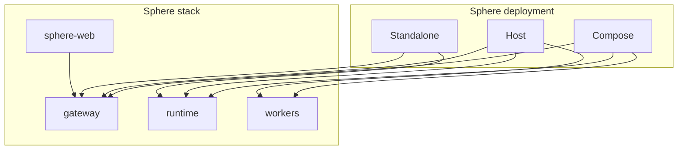
```mermaid
flowchart TB
  subgraph opts["Sphere deployment"]
    Docker[Compose]
    Host[Host]
    Standalone[Standalone]
  end
  subgraph stack["Sphere stack"]
    GW[gateway]
    RT[runtime]
    Workers[workers]
    Web[sphere-web]
  end
  Docker --> GW
  Docker --> RT
  Docker --> Workers
  Host --> GW
  Host --> RT
  Host --> Workers
  Standalone --> GW
  Standalone --> RT
  Web --> GW
```

---

## Security & secrets

| Area | Approach |
|------|----------|
| **Secrets** | Filtered at process level; credentials never reach the LLM. |
| **Lockbox** | Dedicated store for API keys and secrets; agents request access via tools, not raw values. |
| **Guardian (optional)** | Watches for prompt injection, tool abuse, data exfil, memory poisoning; can block high-risk actions. |
| **Human-in-the-loop** | Sensitive or destructive actions can require explicit user approval before execution. |

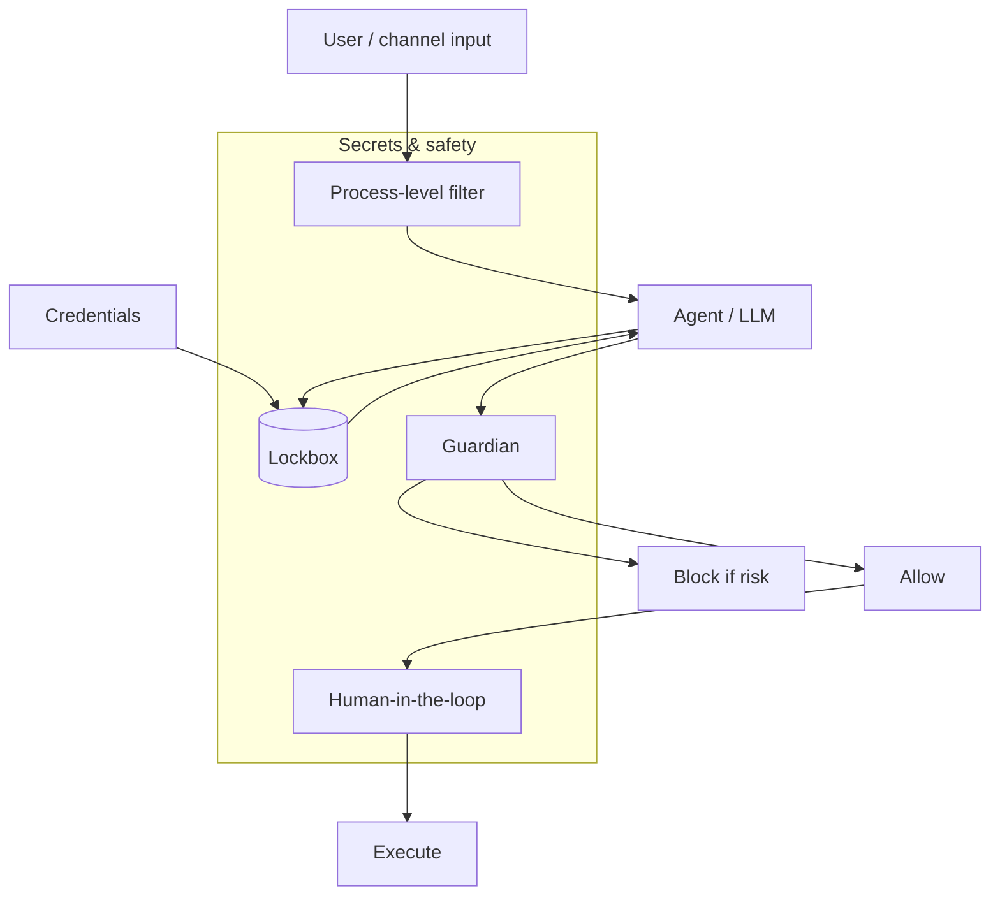
```mermaid
flowchart TB
  subgraph safe["Secrets & safety"]
    Process[Process-level filter]
    Lockbox[(Lockbox)]
    Guardian[Guardian]
    HITL[Human-in-the-loop]
  end
  Input[User / channel input] --> Process
  Process --> Agent[Agent / LLM]
  Creds[Credentials] --> Lockbox
  Agent --> Lockbox
  Lockbox --> Agent
  Agent --> Guardian
  Guardian --> Block[Block if risk]
  Guardian --> Allow[Allow]
  Allow --> HITL
  HITL --> Execute[Execute]
```

---

## Pluggable subsystems

Capabilities are designed so providers can be swapped without forking core logic:

| Subsystem | Examples | Interface |
|------------|----------|-----------|
| **LLM** | OpenAI, Ollama, llama.cpp, Anthropic, Gemini, custom HTTP | Chat/completions API shape |
| **STT** | Whisper, local OpenAI-compatible, future: Deepgram, Google | Audio → text |
| **TTS** | OpenAI, ElevenLabs, Piper (local) | Text → audio |
| **RAG / vectors** | SQLite+sqlite-vec, LanceDB, Chroma, Qdrant, pgvector | Ingest, embed, retrieve |
| **Tools / MCP** | Built-in tools, MCP servers | Tool contract; config-driven |

Each subsystem has a small, stable interface and reads from env/config; install and setup help the user choose and configure providers.

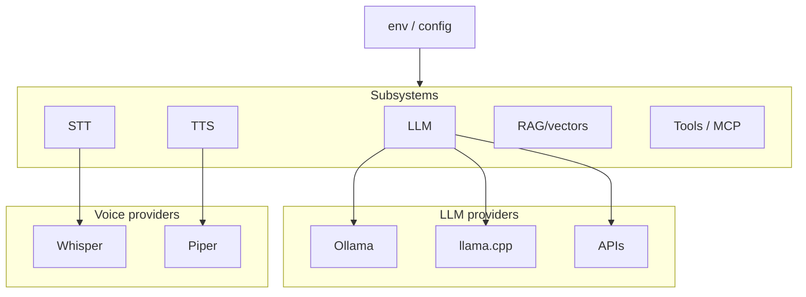
```mermaid
flowchart TB
  subgraph subsystems["Subsystems"]
    LLM[LLM]
    STT[STT]
    TTS[TTS]
    RAG[RAG/vectors]
    MCP[Tools / MCP]
  end
  subgraph providers_llm["LLM providers"]
    O[Ollama]
    L[llama.cpp]
    API[APIs]
  end
  subgraph providers_voice["Voice providers"]
    W[Whisper]
    P[Piper]
  end
  LLM --> O
  LLM --> L
  LLM --> API
  STT --> W
  TTS --> P
  Config[env / config] --> subsystems
```

---

## Development & tooling

| Area | Tool / tech | Notes |
|------|-------------|--------|
| **Build** | **Cargo** | `cargo build`, workspace with shared dependencies and release profiles. BuildKit for Docker cache (Cargo registry, target). |
| **Scripts** | **Bash, PowerShell** | Install, start, stop, doctor, update; cross-platform where possible. |
| **CI** | **GitHub Actions** | Build, test, and optional checks (e.g. memory leak detection). |
| **Rust crates (sample)** | axum, reqwest, tokio, serde, rusqlite, sqlite-vec, tracing, secrecy | HTTP, async, DB, serialization, logging, secret handling. Optional: wasmtime (WASM), sqlx (Postgres). |

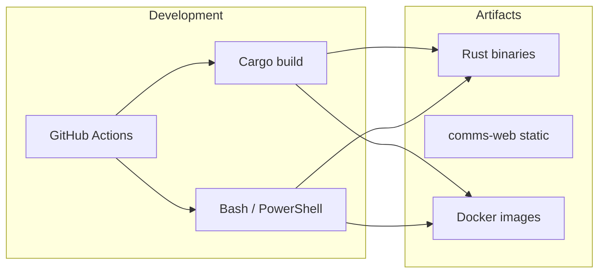
```mermaid
flowchart LR
  subgraph dev["Development"]
    Cargo[Cargo build]
    Scripts[Bash / PowerShell]
    CI[GitHub Actions]
  end
  subgraph artifacts["Artifacts"]
    Bin[Rust binaries]
    Web[comms-web static]
    Docker[Docker images]
  end
  Cargo --> Bin
  Cargo --> Docker
  Scripts --> Bin
  Scripts --> Docker
  CI --> Cargo
  CI --> Scripts
```

---

## Summary

- **Ona backend:** Rust (Tokio, Axum), SQLite (or Postgres), file-based memory/workspace; event-handler + agent-runtime (+ orchestration in gateway mode).
- **Agent model:** Squad-first (Solin orchestrates; ephemeral task agents); SKILL.md skills; tools (code, file, memory, RAG); optional Observer/Guardian; mission group chat.
- **Memory:** Layered (identity, long-term, daily, user, collaborative, RAG, session); RAG pipeline: chunk → embed → vector store → retrieve → augment LLM.
- **Ona frontend:** Astro (web), Electron (desktop); mission control, onboarding, squad, memory, jobs, scheduler, settings.
- **Channels:** Web, Telegram, WhatsApp, Signal, Discord, REST; voice (STT/TTS) first-class.
- **AI:** Ollama, llama.cpp, OpenAI-compatible APIs; per-agent routing; provider adapters (openai, ollama, anthropic, gemini).
- **Security:** Secrets at process level; lockbox; optional Guardian; human-in-the-loop for sensitive actions.
- **Pluggable:** LLM, STT, TTS, RAG/vectors, tools/MCP via config and stable interfaces.
- **Ona deploy:** Docker Compose (or Podman), optional .deb; host binaries for dev/simple installs.
- **Sphere:** Separate stack — Rust gateway + agent-runtime, role-based worker agents (operator, gateway, lockbox, guardian), sphere-web + Electron; Docker Compose or host; connects multiple Onas for identity, policy, and shared governance.

For community, contributing, and policies, see [README.md](README.md) and [CONTRIBUTING.md](CONTRIBUTING.md).
