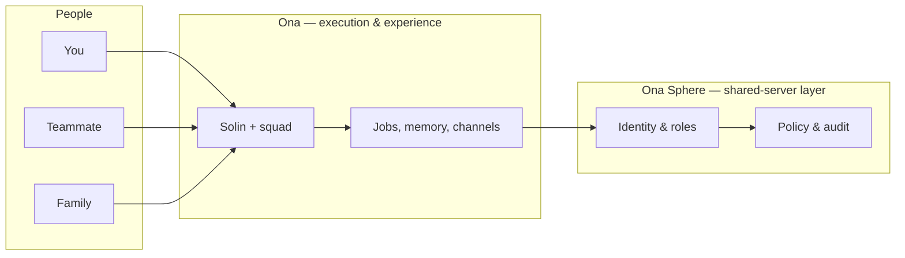
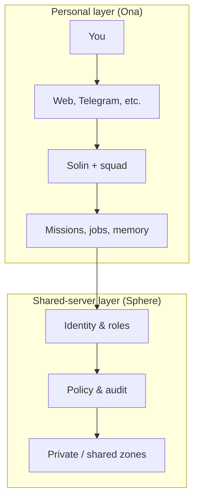

# What Are Ona and Ona Sphere?

**Last updated (UTC): 2026-03-12 17:36**

This document explains, in plain language, what **Ona** and **Ona Sphere** are and how they fit together. Think of it as the “what is this?” guide for the project.

---

## In one sentence

- **Ona** is your private AI layer: you talk to your agent (Solin), who gets work done with a squad of specialists. It runs on your machine or your server.
- **Ona Sphere** is the shared-server layer: when many people (family, team, or company) share one AI system, Sphere adds identity, permissions, and governance so that shared intelligence does not mean shared private data.

**Together:** Ona = “get it done”; Sphere = “get it done safely for many users on one server.” Sphere is optional; Ona works fully on its own.

---

## The big picture

Most AI products stop at chat. **Ona is built for execution.** You give it a mission; it breaks the work into tasks, assigns specialist agents, uses memory and tools, and returns real outcomes. That can happen on the web, in the terminal, or through channels like Telegram and WhatsApp.

When one AI system must serve **many people** (not just you), you need strict boundaries so one user’s data and actions don’t leak into another’s. **Ona Sphere** is that layer: identity, roles, private vs shared zones, and server-level governance.

---

## What is Ona?

Ona is the **execution layer** and the **daily experience**. It is the private, personal AI system you interact with.

### In plain words

- You talk to **Solin** (your main agent).
- Solin coordinates a **squad of specialists** (Writer, Researcher, Developer, Marketer, etc.) to do the work.
- Work is organized as **missions** and **jobs**: not one-off prompts, but tasks with memory, tools, and follow-up.
- You can use it from **web, terminal, Telegram, WhatsApp, Signal, Discord** — same mission system everywhere.
- It runs **locally or on your own server** (VPS). Self-hosted; you can use local models (Ollama, llama.cpp) or cloud APIs. No vendor lock-in.

### What Ona does

| Area | What it does |
|------|----------------|
| **Missions** | Turns your message into a real plan: understand intent, break into tasks, assign to specialists, combine results. |
| **Squad** | One lead (Solin) + specialists (Writer, Researcher, Developer, Marketer, etc.) so complex work is done by the right “role.” |
| **Channels** | Web app, desktop app, CLI, Telegram, WhatsApp, Signal, Discord — one system, many ways in. |
| **Memory & knowledge** | Persistent memory, RAG (search over your docs), so context carries across conversations. |
| **Tools & safety** | Connects to real tools and services; uses a lockbox for secrets; can ask for human approval for sensitive actions. |

So: **Ona is the part people use every day** — the agent, the missions, the memory, the channels. It is the “private personal layer.”

---

## What is Ona Sphere?

Ona Sphere is the **shared-server governance layer**. It is what you add when one deployment must serve many people safely.

### In plain words

- **Ona** = the brain and the workflow (missions, agents, memory).
- **Sphere** = the rules and boundaries so that many users can share one server without seeing each other’s private data or overstepping permissions.

Sphere is built for cases where you need:

- **Shared infrastructure** — one server for family, team, or company.
- **Strict isolation** — your data stays yours; others don’t see it.
- **Roles and permissions** — not everyone has the same power (e.g. admins vs members).
- **Audit and policy** — who did what, and enforcement of rules.

So: **Sphere is the trust boundary and control plane for multi-user Ona.**

### What Sphere adds

| Area | What it adds |
|------|--------------|
| **Identity** | Tenant, user, session, role — operations need valid context or they can be denied. |
| **Roles** | Who can do what (personal vs shared vs admin actions). |
| **Data zones** | Private (per user), shared (group/company), system (operations) — no accidental cross-user leakage. |
| **Server agents** | Dedicated governance agents (e.g. gateway, lockbox, guardian) for policy and security, not task execution. |
| **Audit** | Record of allow/deny and sensitive events so admins can see what happened and why. |

Sphere runs **standalone**: it can be up when Ona is down, and vice versa. When Sphere is enabled, Ona uses it for cross-user and policy-sensitive operations; when Sphere is unreachable, Ona still runs and only skips those shared-server features.

---

## How they work together

- **Default:** Ona runs alone. One user, one machine or VPS. No Sphere required.
- **With Sphere:** Ona still does missions and UX; Sphere handles identity, permissions, and shared boundaries. Startup and lifecycle stay independent: you can start/stop Ona and Sphere separately.
- **If Sphere is down:** Ona keeps working for personal missions, jobs, and channels; it only skips Sphere-backed features and logs a warning.

So you can grow from “just me and my agent” to “many people on one server” without replacing Ona — you add Sphere when you need that.

---

## One-line summary

| Product | One line |
|---------|----------|
| **Ona** | Your private personal layer that gets the mission done. |
| **Ona Sphere** | Get it done safely for many users on one shared server. |

---

## Where to go next

- **Community and contributing:** [CONTRIBUTING.md](CONTRIBUTING.md), [COMMUNITY_AND_MAINTAINERS.md](COMMUNITY_AND_MAINTAINERS.md).
- **What’s in this repo:** [README.md](README.md) — policies, maintainers, get in touch.
- **Main project:** For install, setup, API, and architecture, see the main Ona repository when linked.
